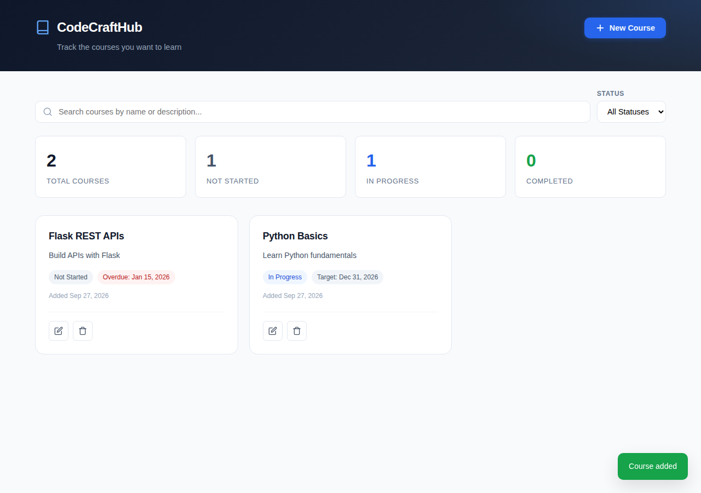

# CodeCraftHub Dashboard

A course management dashboard for the [CodeCraftHub](https://github.com/i-zypher/codecrafthub) REST API. Built with plain HTML, CSS, and JavaScript: no frameworks, no build tools, no install step.



## Features

- **View** all courses as cards, sorted by target date
- **Add** a course with name, description, target completion date, and status
- **Edit** any course in the same form, prefilled with its current values
- **Delete** a course after a confirmation prompt
- **Stats bar** with the total and per-status counts, from `GET /api/courses/stats`
- **Search** by name or description, and **filter** by status
- **Overdue flag** on courses past their target date that aren't completed
- **Clear errors:** the API's own validation messages appear in the form, and a banner with a Retry button appears if the API can't be reached
- **Responsive** layout that works on desktop and mobile

## How to run

1. **Start the backend.** In the `codecrafthub` project:
   ```
   venv\Scripts\activate
   python app.py
   ```
   The API must be running at `http://127.0.0.1:5000` with CORS enabled (`flask-cors`).

2. **Open the dashboard.** Double-click `index.html`. That's it.

If the API runs somewhere else, change `API_BASE` at the top of `script.js`.

## Files

| File | Purpose |
|---|---|
| `index.html` | Page structure: header, stats bar, course grid, add/edit and delete modals |
| `style.css` | All styling, including responsive rules and status badge colors |
| `script.js` | Calls the API with `fetch()` and renders the results |

## How it connects to the API

| Action | Request |
|---|---|
| Load courses | `GET /api/courses` |
| Load stats | `GET /api/courses/stats` |
| Add course | `POST /api/courses` |
| Edit course | `PUT /api/courses/{id}` |
| Delete course | `DELETE /api/courses/{id}` |

Every change is followed by reloading the course list and stats, so the page always shows what the backend actually has.

## How it was built

The initial UI was generated with [Bolt.new](https://bolt.new) from a single detailed prompt. Bolt ignored key parts of that prompt: it generated a Vite project backed by its own Supabase database, with a different data model (title, instructor, category, level), instead of calling the CodeCraftHub API. None of its create, read, update, or delete calls reached the Flask backend.

The frontend was then reworked, with the help of Claude, to meet the requirements:

- Kept Bolt's visual design (layout, stylesheet, modals, toast notifications)
- Replaced the Supabase client with `fetch()` calls to the Flask API
- Changed the form and cards to the real course fields (name, description, target date, status)
- Wired the stats bar to the stats endpoint
- Added API error handling and a connection banner
- Removed the build tooling so it runs as three plain files, as the project requires

The lesson: AI-generated code has to be checked against the requirements, not just the preview. Bolt's preview looked finished and worked, but it was connected to the wrong backend.
